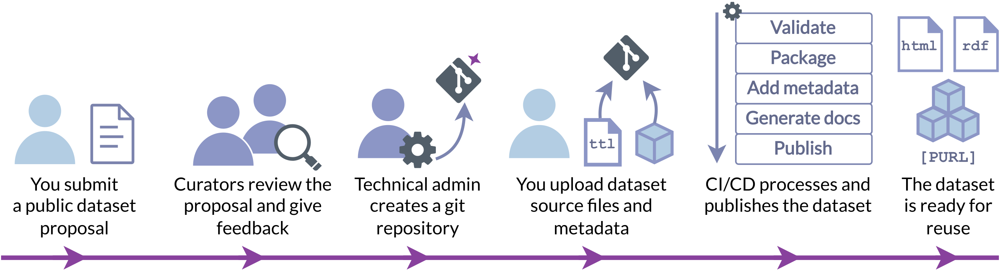

{{ top_buttons() }}

# Creating a new dataset

This guide explains step-by-step how to propose a new dataset for inclusion in RiverBench. You only need to prepare the dataset and its metadata – the rest of the process will be carried out by a RiverBench admin and automated scripts.

## Step 0: Check the requirements

Before you start, have a look at the requirements for new datasets listed below. If your dataset does not meet these requirements, it will not be accepted.

- **Freely licensed** – the dataset must be licensed under a free license, such as [CC0](https://creativecommons.org/publicdomain/zero/1.0/), [CC BY](https://creativecommons.org/licenses/by/4.0/), or [CC BY-SA](https://creativecommons.org/licenses/by-sa/4.0/). The license must allow commercial use and derivative works.
- **Somewhat streaming in nature** – streaming comes in many shapes and sizes. Have a look at the existing datasets – we have [streams of timestamped weather data](../datasets/assist-iot-weather/index.md), but also [a stream of fact annotations in Wikidata](../datasets/yago-annotated-facts/index.md). The important thing is that the dataset must be explicitly split into discrete elements.
    - **Do you have a non-streaming dataset?** We have an open [task](https://github.com/RiverBench/RiverBench/issues/129) to allow non-streaming datasets in RiverBench. If you are interested in this, please [comment on the issue](https://github.com/RiverBench/RiverBench/issues/129) to let us know.
- **Interesting technically** – we are especially interested in expanding the coverage of the rarer types of streams, such as those using RDF-star, generalized triples, or quads. Other interesting types of datasets include those that use RDF in atypical ways, like with large GeoSPARQL literals or dense vector embeddings. Anything exotic is welcome!
- **Interesting thematically and relevant** – does your dataset bring an interesting new use case? Perfect! Even better if the use case has seen real-world usage.
- **Large** – the stream must be at least 10 thousand elements long, preferably more. The larger the better.

## Step 1: Create a dataset proposal

Open a new dataset proposal in the RiverBench repository: <a href="https://github.com/RiverBench/RiverBench/issues/new?assignees=Ostrzyciel&labels=new+dataset&projects=&template=dataset-proposal.yml&title=Dataset+proposal%3A+%5BIDENTIFIER+HERE%5D" target="_blank" class="md-button md-button--primary rb-small-button" markdown>**:material-database-plus: New dataset proposal**</a>

Fill in the fields with the required information, using the instructions embedded in the form.

!!! note

    If you have trouble filling in any of the fields, you can leave them blank and ask [a maintainer](maintainers.md) for help.

## Step 2: Wait for approval

[RiverBench curators](maintainers.md) will be notified your request and will review the form and the dataset. The maintainers may ask for additional information or clarifications. Once reviewed, a technical administrator will create a new repository for you and give you access to it.

## Step 3: Upload the dataset sources

1. Create a source archive by following the [guide on preparing a source archive](dataset-source-format.md).
2. Access the repository created for your dataset and click on "Releases" in the right sidebar.
3. Click on the "Create a new release" button to start the process of creating a new release for your dataset.
4. Fill in the following fields for the new release:
    - Input "source" as the tag for the release.
    - Enter "Source" as the release name.
    - Check the "Set as a pre-release" option (it's below the large text field).
    - Leave other options unchanged.
5. Upload the prepared source archive (`source.tar.gz`) by dragging and dropping the file into the designated area.
6. Once the source archive is attached, click on the "Publish release" button to finalize the upload.

## Step 4: Fill out the metadata

1. Open the `metadata.ttl` file in your new dataset repository.
2. Use the information from the issue template you filled out earlier to complete the required fields in the `metadata.ttl` file. Replace the placeholder text with the appropriate information from the template.
    - You can have a look at the metadata of [other datasets](../datasets/index.md) for reference.
    - In the `dcterms:description` field and other free-text fields you can use Markdown formatting.
    - For `dcat:theme` use concepts from the [EuroVoc thesaurus](https://op.europa.eu/en/web/eu-vocabularies/concept-scheme/-/resource?uri=http://eurovoc.europa.eu/100141). Use only elements of type "Concept" (without a number in their name), not "Concept scheme" or "Domain concept".
3. Open the `LICENSE` file and replace the placeholder text with the license of the dataset. You can find commonly used templates [here](https://github.com/licenses/license-templates/tree/master/templates).
4. Save your changes and commit to the main branch.
5. Post a comment in your issue saying that you have completed the metadata for your dataset. The technical administrator will then finalize adding the dataset to the suite and provide any necessary assistance.

----

## Instructions for maintainers

### Reviewing the proposal

- Review the issue template – make sure all required information is provided and that it's clear.
- Check if the dataset meets the [requirements](#step-0-check-the-requirements).
    - Deciding whether or not the dataset should be in RiverBench is up to you. Is there a need for it? Will it make the benchmarks more diverse and representative? Does it cover a new use case?

### Technical: setting up the dataset

- [Create a new repository](https://github.com/organizations/RiverBench/repositories/new) for the dataset with name `dataset-[IDENTIFIER]`. In the repository settings:
  - Use the `RiverBench/dataset-template` repository as the template.
  - Mark the repo as public.
- Add the dataset maintainer as a collaborator to the repository in repo settings.
- Reply in the issue to the maintainer with the link to the repository and a link to step 3 of this guide.
- After the maintainer completes steps 3 and 4, check if the CI passes correctly up to the dataset and documentation update steps (these should fail). If not, try to fix the issue.
- Go to the [organization secret settings](https://github.com/organizations/RiverBench/settings/secrets/actions). For secrets `PAT_DOC_REPO_HOOKS`, `PAT_MAIN_REPO_HOOKS`, and `PAT_DATASET_CAT_REPO_HOOKS` add repository access for the new dataset repository.
- In [Zenodo settings](https://zenodo.org/account/settings/github/) enable the new repository.
- Create a new branch in the main repo (RiverBench/RiverBench) for the proposal issue.
- In the new branch, run `git submodule add ../dataset-[ID] datasets/[ID]`.
- Commit and push changes to GitHub.
- Create a pull request for the branch and merge it to main.
- Re-run the CI in the dataset repo and check if the dataset and documentation update steps pass correctly.
- After all CI finishes check if the [dataset list](../datasets/index.md) and profiles were updated correctly. Check the dataset's documentation page for any obvious issues.

## See also

- [Creating a new benchmark task](creating-new-task.md)
- [Editing the documentation](editing-docs.md)
