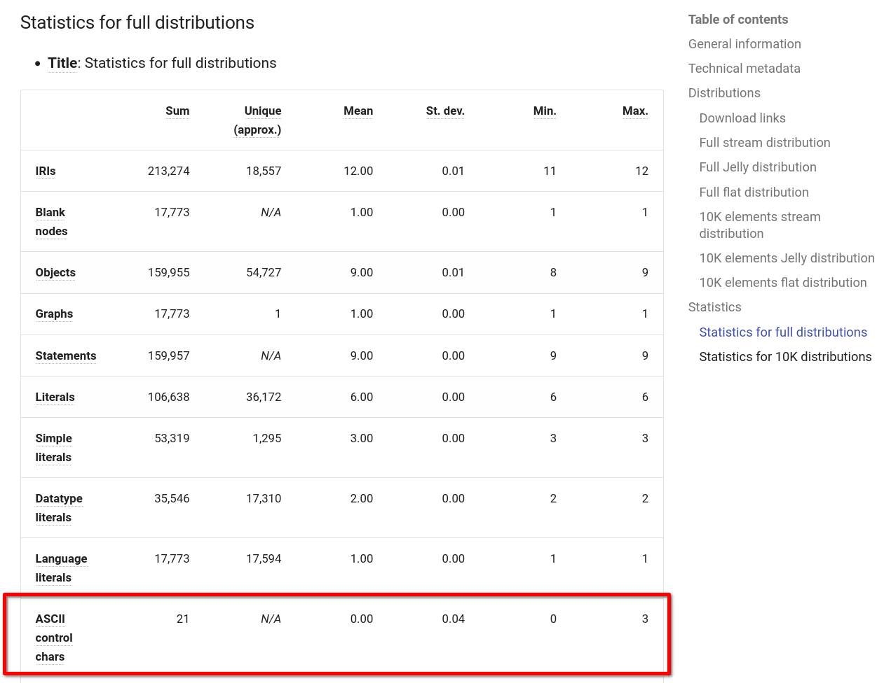

{{ top_buttons() }}

# Dataset compatibility notes
<!-- Note: this specific title (Dataset compatibility notes) is used in the RiverBench metadata ontology to point users here. If you rename this page, update the ontology. -->

RiverBench uses the [RDF 1.1 specification](https://www.w3.org/TR/rdf11-concepts/) as its compatibility basis. However, life is never that simple. This page explains the various quirks in RDF 1.1 support across different systems, as well as its extensions and non-standard features.

## ASCII control characters and RDF/XML

RDF 1.1 allows any valid Unicode string to be used as the lexical value of an RDF literal ([see the spec](https://www.w3.org/TR/rdf11-concepts/#section-Graph-Literal)). This notably includes all ASCII characters from `0x00` to `0x1F`, which are commonly referred to as ASCII control characters.

A few of these characters are troublesome some RDF systems. The most notable example of this is the [RDF/XML 1.1 serialization format](https://www.w3.org/TR/rdf-syntax-grammar/) which uses [XML 1.0](https://www.w3.org/TR/xml/) as its basis. XML 1.0 disallows using certain ASCII control characters in XML documents, and at the same time it also disallows using the `&#xHH;` escape sequences for these characters. This means that XML 1.0 and, in turn, RDF/XML 1.1 cannot represent these characters *at all*.

Namely, the following characters cannot be encoded in RDF/XML 1.1:

- `0x00`-`0x08`
- `0x0B`
- `0x0C`
- `0x0E`-`0x1F`

It should be stressed here that literals using these characters are completely valid according to RDF 1.1, and there are real-life use cases where these characters may occur. For example, in datasets with web-scraped data, such as [`politiquices`](../datasets/politiquices/index.md), [`nanopubs`](../datasets/nanopubs/index.md), or [`openaire-lod`](../datasets/openaire-lod/index.md), such "ugly" strings are common.

As the issue concerns only one serialization format (and a "legacy" one at that), RiverBench took the decision to keep these characters as-is in its datasets, to accurately represent the original data. This means that some datasets may not be fully representable in RDF/XML 1.1. Instead, RiverBench computes the number of such characters in the dataset and publishes this information in dataset metadata and documentation.

In the [metadata](metadata.md), the `#!turtle rb:AsciiControlCharacterCountStatistics` class is used to represent the number of ASCII control characters in the dataset. This count includes only the characters problematic for RDF/XML 1.1, as indicated above. These statistics are also displayed on the dataset pages (example from [`politiquices`](../datasets/politiquices/index.md)):

### RDF/XML 1.2

Although RiverBench does not support RDF 1.2 (as it is not finalized yet), it is worth mentioning that [RDF/XML 1.2](https://www.w3.org/TR/rdf12-xml/) will upgrade to [XML 1.1](https://www.w3.org/TR/xml11), which added support for escaping the aforementioned characters, except for `0x00`. This means that RDF/XML 1.2 will still technically not be able to represent all RDF literals, but at least the range of incompatible characters will be much smaller.

## RDF-star

RiverBench also includes datasets that use [RDF-star](https://www.w3.org/2021/12/rdf-star.html), an unofficial extension of RDF 1.1. To determine conformance, RiverBench uses the [RDF-star Final Community Group Report 17 December 2021](https://www.w3.org/2021/12/rdf-star.html) as the reference document. Datasets using RDF-star are marked as such in the metadata and documentation, and are present only in `*-rdfstar` benchmark profiles.

It is expected that the functionalities of RDF-star will be integrated into RDF 1.2, and that the current RDF-star-enabled datasets of RiverBench will be fully compatible with the new standard. This, however, depends on the final form of RDF 1.2.

## Other non-standard RDF features

RiverBench welcomes datasets that extend RDF 1.1 in other ways, such as using generalized triples, or introducing something entirely new. In that case, such a dataset will be appropriately marked and placed in a separate `nonstandard` benchmark profile. When [submitting your dataset](creating-new-dataset.md), you will have the option to point out any non-standard features of your dataset.

## See also

- [Dataset release format](dataset-release-format.md)
- [Using RiverBench in practice](using.md)
