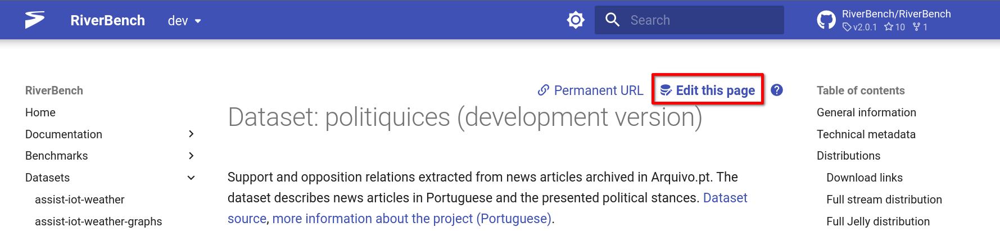

{{ top_buttons() }}

# Editing documentation

You are welcome to edit any page in RiverBench – be it a [dataset description](../datasets/index.md), a [benchmark task definition](../tasks/index.md), or a [documentation page](index.md). To do this, simply use the _:material-file-edit: Edit this page_ button at the top of the page:

It will take you to GitHub, where you will be prompted to [fork](https://docs.github.com/en/pull-requests/collaborating-with-pull-requests/working-with-forks/fork-a-repo) the repository and create a pull request with your changes.

The documentation pages are written in Markdown. However, some pages like datasets, tasks, and profiles are generated automatically from RDF metadata written in the Turtle language. In that case, you will find a button like this at the top of the page:

Simply edit the values in the metadata file and the documentation will be updated automatically. You can read more about the structure of the metadata in the [metadata documentation](metadata.md).

!!! warning "Gotcha!"

    You cannot edit pages of a stable release of RiverBench (e.g., 2.0.1) – that would make no sense, as the release is immutable. Instead, you can edit the development version of the documentation, which will be included in the next release.

    To be able to edit pages, switch to the `dev` version of the documentation using the version selector in the top navigation bar or by clicking **[here](https://w3id.org/riverbench/)**.

## Technical details

The RiverBench website is rendered from Markdown files using MkDocs and lives in the [riverbench.github.io repository](https://github.com/RiverBench/riverbench.github.io). Most files there are automatically generated and updated by CI scripts. However, some files are static and can be edited directly.

In the riverbench.github.io repo you can edit:

- `docs/assets` – static assets and images
- `docs/documentation` – all files in this directory are static documentation pages
- `docs/datasets/index.md` – the overview page for datasets
- `docs/categories/index.md` – the overview page for categories
- `docs/schema/index.md` – the overview page for schemas

### Editing the homepage and main README

In the [`doc` directory of the main repo](https://github.com/RiverBench/RiverBench/tree/main/doc) you will find the files that are used to build the index page of the website and the main README of the repository. These files are written in Markdown and can be edited directly.

## See also

- [Metadata in RiverBench](metadata.md)
- [How to contribute?](contribute.md)
