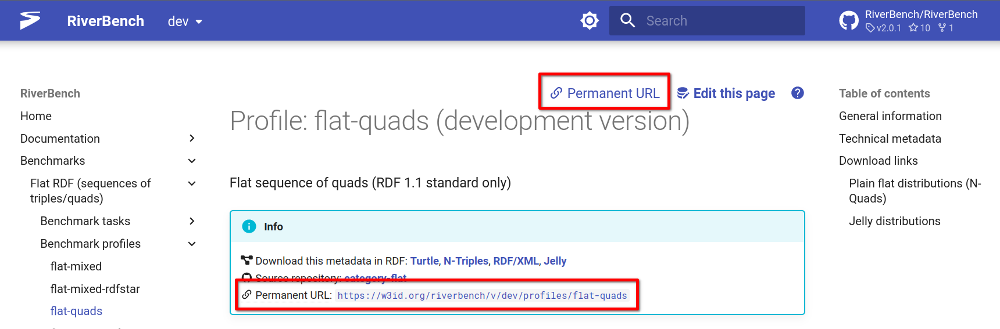
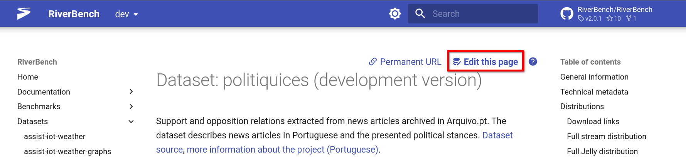

{{ top_buttons() }}

# Metadata

RiverBench includes rich RDF metadata for each dataset, profile, schema, and the suite itself. This metadata is used to generate the website, and can also be used by other tools. The metadata is [permissively licensed](licensing.md).

## Accessing metadata

On each page of a RiverBench resource (e.g., dataset, task, profile) you will find a box with links to the RDF metadata. You can also use the [HTTP content negotation mechanism](https://developer.mozilla.org/en-US/docs/Web/HTTP/Content_negotiation) on permanent URLs (starting with `https://w3id.org/riverbench/`) to request the machine-readable metadata instead of the HTML page.

You can find the permanent URL in the _Info_ box with metadata download links, or by copying the _:material-link-variant: Permanent URL_ link in the top right corner of the page:



Examples of URLs that will return the metadata with content negotiation:

* [https://w3id.org/riverbench/](https://w3id.org/riverbench/)
* [https://w3id.org/riverbench/v/dev](https://w3id.org/riverbench/v/dev)
* [https://w3id.org/riverbench/v/dev/categories/flat](https://w3id.org/riverbench/v/dev/categories/flat)
* [https://w3id.org/riverbench/v/dev/profiles/stream-datasets](https://w3id.org/riverbench/v/dev/profiles/stream-datasets)
* [https://w3id.org/riverbench/v/dev/tasks/flat-compression](https://w3id.org/riverbench/v/dev/tasks/flat-compression)
* [https://w3id.org/riverbench/datasets/nanopubs/dev](https://w3id.org/riverbench/datasets/nanopubs/dev)
* [https://w3id.org/riverbench/schema/metadata/dev](https://w3id.org/riverbench/schema/metadata/dev)

To request a metadata file in a given format explicitly, you can also append `.nt`, `.ttl`, `.rdf`, or `.jelly` to these URLs.

The following metadata formats are supported:

- [N-Triples](https://www.w3.org/TR/n-triples/) (`.nt`, content type `application/n-triples`)
- [Turtle](https://www.w3.org/TR/turtle/) (`.ttl`, content type `text/turtle`)
- [RDF/XML](https://www.w3.org/TR/rdf-syntax-grammar/) (`.rdf`, content type `application/rdf+xml`)
- [Jelly](https://github.com/Jelly-RDF) (`.jelly`, content type `application/x-jelly-rdf`)

*If you are curious, you can find the rules that make this work [here](https://github.com/perma-id/w3id.org/tree/master/riverbench).*

## Metadata dumps

Starting from RiverBench version 2.0.0, the entire metadata of RiverBench is published in easily accessible dumps. The dumps can be downladed from the [main page of RiverBench](https://w3id.org/riverbench/) and from the pages of the [suite releases](https://w3id.org/riverbench/v). The links to download the dump are in the "Info" box near the top of the page.

The dumps can also be downloaded directly from:

```https://w3id.org/riverbench/dumps/{version}.{extension}.gz```

where `{version}` is the version tag of the suite release (e.g., `dev` or `2.0.0`), and `{extension}` is one of `nt`, `ttl`, `rdf`, or `jelly`.

## Editing metadata

A large portion of the metadata is automatically generated. However, the rest is written manually in Turtle files in various repositories:

- [RiverBench main repo / metadata.ttl](https://github.com/RiverBench/RiverBench/blob/main/metadata.ttl) – metadata about the suite itself
- [{Dataset repo}](https://github.com/orgs/RiverBench/repositories?type=all&q=dataset-+template%3Afalse+-lang%3AScala+archived%3Afalse+) / metadata.ttl – metadata about the dataset
- [{Category repo}](https://github.com/orgs/RiverBench/repositories?type=all&q=category-+template%3Afalse+-lang%3AScala+archived%3Afalse+) / metadata.ttl – metadata about the benchmark category
- [{Category repo}](https://github.com/orgs/RiverBench/repositories?type=all&q=category-+template%3Afalse+-lang%3AScala+archived%3Afalse+) / profiles / {profile name}.ttl – metadata about the profile
- [{Category repo}](https://github.com/orgs/RiverBench/repositories?type=all&q=category-+template%3Afalse+-lang%3AScala+archived%3Afalse+) / tasks / {task name} / metadata.ttl – metadata about the benchmark task

All of these files can be conveniently accessed and edited using the _:material-database-edit: Edit this page_ or _Edit metadata_ button at the top of the page:



Feel free to submit pull requests to these files to fix errors or add new information. After the pull request is accepted, the changes will be reflected automatically in the website and the READMEs.

### Used ontologies

The metadata uses mainly these ontologies:

- [DCAT 3](https://www.w3.org/TR/vocab-dcat-3/)
- [DCMI Metadata Terms](https://www.dublincore.org/specifications/dublin-core/dcmi-terms/)
- [FOAF](http://xmlns.com/foaf/0.1/)
- [RDF Stream Taxonomy (RDF-STaX)](https://w3id.org/stax/dev/ontology) – for RDF stream type annotations
- [EuroVoc](https://op.europa.eu/en/web/eu-vocabularies/dataset/-/resource?uri=http://publications.europa.eu/resource/dataset/eurovoc) – for dataset themes
- [VoID](https://www.w3.org/TR/void/)
- [RiverBench metadata ontology](../schema/metadata.md)
- [RiverBench documentation ontology](../schema/documentation.md)
