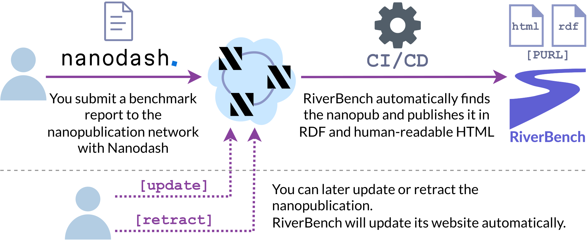
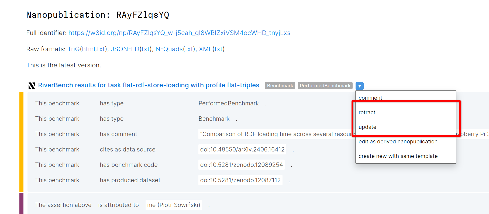

{{ top_buttons() }}

# Reporting benchmark results

If you have used RiverBench's datasets or tasks to run a benchmark, we **highly encourage you to share your results**. Already familiar with the process? Jump straight in:

<div style="text-align: center" markdown><a href="{{ report_results_url() }}" target="_blank" class="md-button md-button--primary"  markdown>:material-star-plus: New benchmark results report</a></div>



## Why report results?

Your benchmark run will be listed on the [RiverBench website](../results/index.md) in a machine- and human-readable format. The results are also presented in detail for each benchmark task (see [example here](../tasks/flat-rdf-store-loading/results.md)). This way, others will be able to easily find your paper, benchmark code, and results.

The benchmarks are reported as small RDF files ([nanopublications](https://nanopub.net/)), making them easy to integrate with other tools and datasets. Our small dream is to some day have a large collection of benchmark results that can be easily compared and analyzed. A living literature review, if you will.

## How to report results

1. Open the form by clicking the button above or using **<a href="{{ report_results_url() }}" target="_blank">this link</a>**. This will take you to Nanodash, a tool for editing nanopublications.
2. If you have never used Nanodash before, it will ask you to sign in using ORCID. Any nanopublications that you create will be forever linked to your ORCID identifier.
3. Fill out the form with the details of your benchmark run. The form's contents will be translated to RDF, so its fields directly correspond to triples in the nanopublication.
    - In _cites as data source_ paste the DOI link to your paper/report. If you don't have a DOI, you can use a different kind of link. DOIs are preferred, because they allow us to automatically cite your work on the RiverBench website.
    - In _has benchmark code_ and _has produced dataset_ you can optionally paste links to your benchmark code and the dataset with your benchmark results (DOIs preferred).
    - In _uses RiverBench task_ paste a valid permanent URL of the [RiverBench task](../categories/index.md) that you have used in your benchmark. The URL must refer to a stable version of the task, not the development version. 
        - [How to obtain the permanent URL?](metadata.md#accessing-metadata)
        - The URL should look like this:<br>`https://w3id.org/riverbench/v/{version}/tasks/{task-ID}`
    - In _uses RiverBench profile_ paste a valid permanent URL of the [RiverBench profile](../categories/index.md) (collection of datasets) that you have used in your benchmark. The URL must refer to a stable version of the profile.
        - The URL should look like this:<br>`https://w3id.org/riverbench/v/{version}/profiles/{profile-ID}`
    - In _uses benchmark metric_, specify in plain text what metrics you have measured in the benchmark. Try to use the exact same wording as in the task definition.
    - In the last two fields, you can specify the systems that you have benchmarked, along with their versions.
4. (Optional) Select a license for the nanopublication. In order for your results to be listed on the RiverBench website, you **must** use either the CC BY 4.0 (selected by default) or the CC0 1.0 license.
5. Read and check the checkbox at the bottom of the form to confirm that you agree to having your results published.
6. Click the _Publish_ button.

Example of a filled-out nanopublication: **[link](https://nanodash.petapico.org/explore?id=https://w3id.org/np/RAyFZlqsYQ_w-j5cah_gI8WBIZxiVSM4ocWHD_tnyjLxs)**.

**That's it!** Your results will appear on the RiverBench website after the next update (at most 3–4 days). If you don't see your results or just don't like waiting, feel free to [nudge the maintainer](https://github.com/Ostrzyciel).

### I have questions...

If you have any questions about the nanopublication form, the process, or anything else, feel free to [open an issue on GitHub](https://github.com/RiverBench/RiverBench/issues) or [ask the maintainer directly](https://github.com/Ostrzyciel).

### Retracting or updating the nanopublication

Nanopublications cannot be deleted. They can, however, be superseded with a newer nanopublication, or marked as retracted. If you've made a mistake, or there is something you need to change, open the URL of your nanopublication. Then, log in to Nanodash using the "Login with ORCID" button in the top-right. Then, in the dropdown menu next to the nanopublication you will find the options to update and retract it:



After an update or a retraction, the old nanopublication will be removed from the RiverBench website.

## Querying nanopublications

RiverBench gathers all benchmark result reports and re-publishes them in [metadata dumps](metadata.md#metadata-dumps). However, you can also access the published nanopublications using one of the [available tools](https://nanopub.net/docs/network), including a SPARQL endpoint. You can look for the following triple pattern:

```sparql
PREFIX rb: <https://w3id.org/riverbench/schema/metadata#>

SELECT ?benchmark
WHERE {
    ?benchmark a rb:PerformedBenchmark .
}
```

## See also

- [Reported benchmark results](../results/index.md)
- [Contributing to RiverBench](contribute.md)
- [Accessing the published results as RDF](metadata.md#metadata-dumps)
